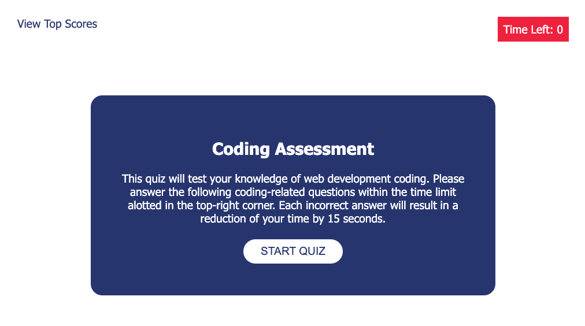
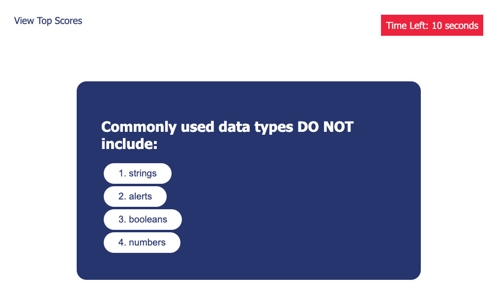
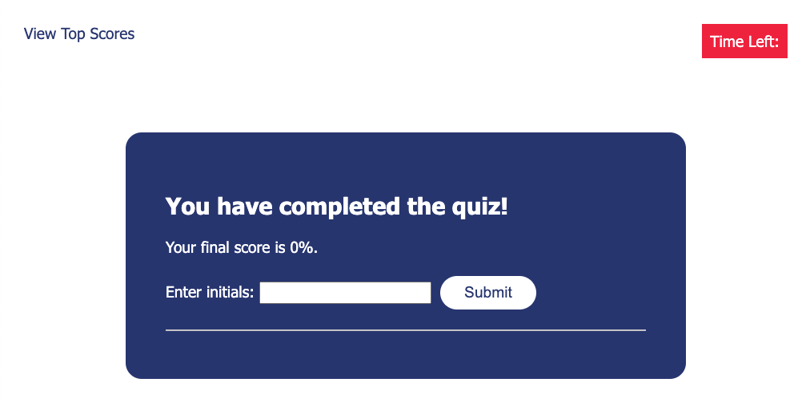
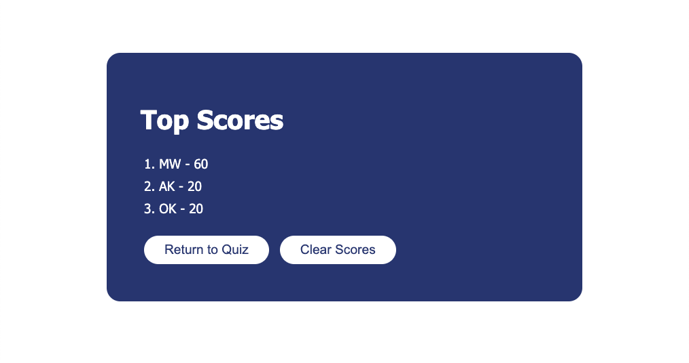

# Module 04 Challenge

## Description

This assignment was to create a fully-functioning coding quiz for a user who may need to be tested on their coding knowledge. Passing an assessment of your knowledge shows potential employers that you have experience with the terms and technology of web development.

## Mockup

Mockup of the deployed application's start screen:

Mockup of one of the question & answer screens:

Mockup of the final screen:

Mockup of the highscores page:

## Deployment

[Click here to view the deployed application.](https://michiewillman.github.io/Module_04_Challenge/)

[Click here to view my code repository.](https://github.com/michiewillman/Module_04_Challenge)
